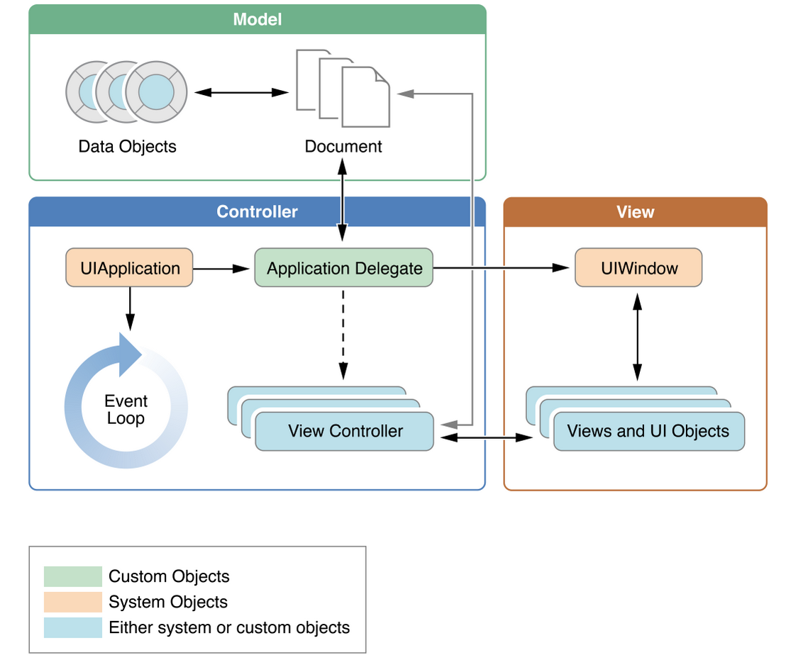

# Klasse

```swift
class NewMessageViewController: UIViewController {
    // subclass definition goes here

}
```

^
- Her arver vi fra UIViewController som er basis for alle viewControllers
- ViewControllers er bindeleddet mellom grafisk grensesnitt og kode
- F.eks - bruker klikker på en knapp - da gis ViewController beskjed at brukeren klikket på knappen og vi utviklere håndterer hva som skal skje

---

# iOS - design patterns



^ 
- MVC, delegates
- Separations of concerns
- Separerer data og business logic fra den brukergrensesnittet (visuelle presentasjonen av data)
- Twitter lagrer f. eks meldingene som data objekter
- ViewController kontrollerer et view og hva som skal vises der. Bindeleddet mellom grensesnitt og data

^https://developer.apple.com/library/ios/documentation/iPhone/Conceptual/iPhoneOSProgrammingGuide/TheAppLifeCycle/TheAppLifeCycle.html#//apple_ref/doc/uid/TP40007072-CH2-SW1

---

# Navigation Controller


^
- Flere slike container controllers
- TabViewController, PageBasedViewController, CollectionView

---

# App cycle

- Oppstart håndteres automatisk
- Utvikler blir gitt kontroll når brukergrensesnitt skal initialiseres.
- Execution state: Not running, inactive, active, background, suspended.
- UIApplication, UIWindow. 

^
- Not running: App kjører ikke. Terminert.
- Inaktiv: Mellomsteg fra å være aktiv til å bli suspended/background
- Active: App kjører og vises på skjermen. s
- Background: App kjører kode i bakgrunn. Spotify, 
- Suspended: App ligger i minne men kjører ikke kode. Kan bli slettet fra minne hvis mer minne trengs
- Kan ha to UIWindow (handOff til ipad)

---

# Threads and Concurrency

- GUI operasjoner må gjøres på Main thread (MT)
- Lange utregninger bør gjøres i egen tråd (nettverk, fil-aksess)

```swift
dispatch_async(dispatch_get_main_queue(), {
    self.tableView.reloadData()
})
```
---

# Threads and Concurrency

```swift
var bgIdentifier: UIBackgroundTaskIdentifier!

bgIdentifier = UIApplication.sharedApplication().beginBackgroundTaskWithExpirationHandler({
  UIApplication.sharedApplication().endBackgroundTask(bgIdentifier)
})

// Do long running task
```
---

# Storyboards


^
- Hvor brukergrensesnittet lages
- Dra opp xCode for å vise storyboarde


