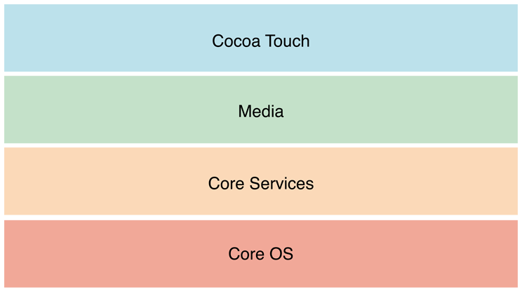
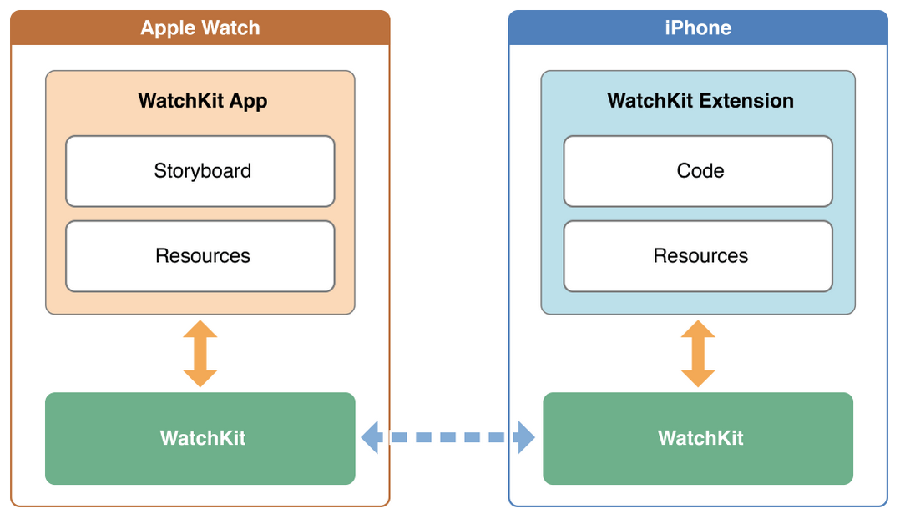

# Swift-kurs

---

## Agenda

1. Om Bekk
2. Swift
3. Xcode
4. Lunch
5. Koding og presentasjon
6. Oppsummering
7. Mat og drikke

---

## Om Bekk

- Konsulentfirma
- Hovedkontor i Oslo
- IT, design og økonomi

^
- Også i Trondheim
- Presentere oss selv 
- Nevne hvor vi jobber slik at studenter får innblikk i hverdagen

---

## Swift

- Tar over for Objective-C
- For iOS og OSX
- Lavere terkel å komme i gang
- OOP, funksjonelt, imperativ
- Forbedres stadig

---

## Syntax

```swift
println("Hello, world!")

// hello world
```
---

## Variabler og konstanter

```swift
let shortName: String = "UiT"
var students: Int = 100

students = 150
shortName = "UiB" 	// Compile error

```

^
- let er konstant, var er for variable verdier
- Type inference - kompiler finner ut om det er string eller int. Trenger 
ikke å spesifiseres
- Kan spesifisere type hvis ønsket

---

## Type inference

```swift
let shortName = "UiT"
var students = 100

let  = "UiT", "UiB", "NTNU"
```
---

## Arrays

```swift
var jobber = ["CSS-guru", "Designer", "Backend-utvikler"]
var jobber: String = ["CSS-guru", "Designer"]
var fakultet = ["Informatikk" : 50, "Lege" : 100,  "Biokjemi" : "Brent ned"]
```

^
- array defineres med brackets. Kan inneholde ulike typer; strings, heltall, array, dictionary
- Kan spesifisere type
- Samme med dictonary. Her ser vi både heltall og string


---

## for-løkker

```swift
var jobber = ["CSS-guru", "Designer", "Backend-utvikler"]

for jobb in jobber {
	println("\(jobb)")
}

for number in 0..100 {
	println("\(number)")
}
```

^
- Itere gjennom løkker -> skrives som en setning. Veldig forenkla syntax fra tidligere
- Teller opp til 100, printer ut

---

## Funksjoner
```swift
func addTwo(a: Int) -> Int {
	return a + 2
}

let number = addTwo(5)  // 7
```
^
- Funksjonelle paradigme i vinden
- Små korte funksjoner som gjør en ting og kan kombineres hvor resultatet av den ene 
bygger på den andre

---

## Closures

```swift
let names = ["Chris", "Alex", "Ewa", "Barry", "Daniella"]

func backwards(s1: String, s2: String) -> Bool {
	return s1 > s2
}

var reversed = sorted(names, backwards)

// reversed is equal to ["Ewa", "Daniella", "Chris", "Barry", "Alex"]
```

^
- Funksjonelle paradigme i vinden
- Små korte funksjoner som gjør en ting og kan kombineres hvor resultatet av den ene 
bygger på den andre
- Tidligere het det blocks, ser litt ut som javascript
- Hvis s1 er større enn s2 returnerer funksjonen true. DVS s1 skal være før s2
- Greather than ">" for strings -> This means that the letter "B" is “greater than” the letter "A"

---

## Klasser 

```swift
class VideoMode {
      var resolution = Resolution()
      var interlaced = false
      var frameRate = 0.0
      var name: String?

      // Funksjoner her
 }
 ```

^
- Slipper unna interface filer slik som i c og obj-c. Automatisk tilgjengelig i andre filer
- Automatic Reference Counting - frigjør objekter fra minne når ingen peker lengere på de (sterk reference). Kan ha weak reference 
som gjør at objekt blir frigjort når siste sterke ref. fjernes
- Kopierer ved assignment på structs. Faktisk minne referanse ved objekter. Passed by value, passed by reference

---

## Klasse arv

```swift
class NewMessageViewController: UIViewController {
    // subclass definition goes here
}
```

^
- Her arver vi fra UIViewController som er basis for alle viewControllers
- ViewControllers er bindeleddet mellom grafisk grensesnitt og kode
- F.eks - bruker klikker på en knapp - da gis ViewController beskjed at brukeren klikket på knappen og vi utviklere håndterer hva som skal skje

---

# Computes Properties

```swift
struct Rect {
    var origin = Point()
    var size = Size()
    var center: Point {
        get {
            let centerX = origin.x + (size.width / 2)
            let centerY = origin.y + (size.height / 2)
            return Point(x: centerX, y: centerY)
        }
        set(newCenter) {
            origin.x = newCenter.x - (size.width / 2)
            origin.y = newCenter.y - (size.height / 2)
        }
    }
}

```

---

## iOS

- OS for iPad, iPhone, and iPod
- Rammeverk ligger i Cocoa Touch
- Push, Message, UIkit, Adresss Book


^ 
- Kjøres på ipad, iphone og iPod
- Cocoa Touch
- Bygd rundt rammeverk som du drar inn for å få ulike tjenster. Push, Message, UIkit, Adresss book, Event kit
- Bruker får popup om han ønsker å gi tilgang til gitt tjeneste

---

# iOS - design patterns


^ 
- MVC, delegates
- Separations of concerns
- Separerer data og business logic fra den brukergrensesnittet (visuelle presentasjonen av data)
- Twitter lagrer f. eks meldingene som data objekter
- ViewController kontrollerer et view og hva som skal vises der. Bindeleddet mellom grensesnitt og data


^https://developer.apple.com/library/ios/documentation/iPhone/Conceptual/iPhoneOSProgrammingGuide/TheAppLifeCycle/TheAppLifeCycle.html#//apple_ref/doc/uid/TP40007072-CH2-SW1

---

# App cycle

- Oppstart håndteres automatisk
- Utvikler blir gitt kontroll når brukergrensesnitt skal initialiseres.
- Execution state: Not running, inactive, active, background, suspended.
- UIApplication, UIWindow.

^
- Not running: App kjører ikke. Terminert.
- Inaktiv: Mellomsteg fra å være aktiv til å bli suspended/background
- Active: App kjører og vises på skjermen. s
- Background: App kjører kode i bakgrunn. Spotify, 
- Suspended: App ligger i minne men kjører ikke kode. Kan bli slettet fra minne hvis mer minne trengs

---

# Threads and Concurrency

- GUI operasjoner må gjøres på Main thread (MT)
- Lange utregninger bør gjøres i egen tråd (nettverk, fil-aksess)

---

# Storyboards


^
- Hvor brukergrensesnittet lages
- Dra opp xCode for å vise storyboarde

---

# Apple Watch

- Interface navigation: Page-based, Hierarkisk
- Images, Text tables, text, labels, 
- Context menus
- Custom views!


---


# Apple Watch

- WatchKit App & WacthKit Extension



^
- WatchKit er på klokka og har storyboard og resources files.
- WatchKit Extension er på mobilen og har kode og resources.
- WatchKit extensions kjører kun når Apple Watch appen kjøres
- Transfer av informasjon skjer transparent.
- Dele data med app group. Lar to prosesser akssesere samme data.
- NSUserDefaults for å dele preferanser - kan være stort sett alt mulig rart strings, int, etc.
- openParentApplication - direkte kommunikasjon med iOS app.
- application:handleWatchKitExtensionRequest:reply:
- https://developer.apple.com/library/prerelease/ios/documentation/General/Conceptual/WatchKitProgrammingGuide/DesigningaWatchKitApp.html#//apple_ref/doc/uid/TP40014969-CH3-SW1


---


